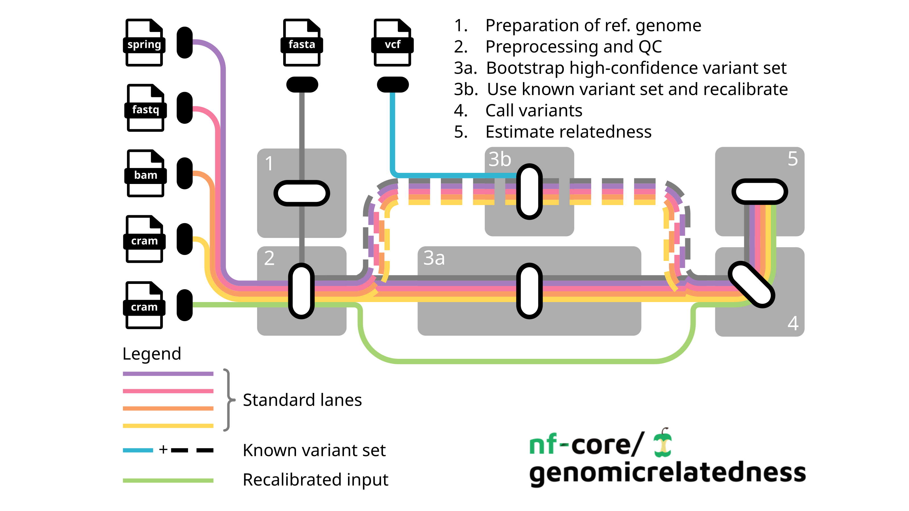

<h1>
  <picture>
    <source media="(prefers-color-scheme: dark)" srcset="docs/images/nf-core-genomicrelatedness_logo_dark.png">
    
  </picture>
</h1>

[](https://github.com/codespaces/new/nf-core/genomicrelatedness)
[](https://github.com/nf-core/genomicrelatedness/actions/workflows/nf-test.yml)
[](https://github.com/nf-core/genomicrelatedness/actions/workflows/linting.yml)[](https://nf-co.re/genomicrelatedness/results)[](https://doi.org/10.5281/zenodo.XXXXXXX)
[](https://www.nf-test.com)

[](https://www.nextflow.io/)
[](https://github.com/nf-core/tools/releases/tag/4.1.0)
[](https://docs.conda.io/en/latest/)
[](https://www.docker.com/)
[](https://sylabs.io/docs/)
[](https://cloud.seqera.io/launch?pipeline=https://github.com/nf-core/genomicrelatedness)

[](https://nfcore.slack.com/channels/genomicrelatedness)[](https://bsky.app/profile/nf-co.re)[](https://mstdn.science/@nf_core)[](https://www.youtube.com/c/nf-core)

## Introduction

**nf-core/genomicrelatedness** is a bioinformatics pipeline for estimating genomic relatedness from low-coverage whole-genome sequencing (lcWGS) data. It performs read mapping, optional base quality score recalibration, variant calling with GATK and BCFtools, and downstream relatedness estimation. For many non-model organisms, no high-confidence variant set is available. The pipeline provides an automated multi-round bootstrapping workflow to generate one. The resulting standardized outputs include genotype likelihood-based variant calls, filtered VCF files, and relatedness estimates from several independent algorithms, enabling robust inference even from very sparse sequencing data.



## Quick Start

1. Install [`nextflow`](https://nf-co.re/usage/installation)

2. Install a container environment for full pipeline reproducibility, e.g. [`Docker`](https://docs.docker.com/engine/installation/), [`Singularity`](https://www.sylabs.io/guides/3.0/user-guide/), [`Podman`](https://podman.io/), [`Shifter`](https://nersc.gitlab.io/development/shifter/how-to-use/) or [`Charliecloud`](https://hpc.github.io/charliecloud/) _(please only use [`Conda`](https://conda.io/miniconda.html) as a last resort; see [docs](https://nf-co.re/usage/configuration#basic-configuration-profiles))_

3. Download the pipeline and test it on a minimal dataset with a single command:

   ```bash
   nextflow run nf-core/genomicrelatedness -profile test,<docker/singularity/podman/shifter/charliecloud/conda/institute>
   ```

   > Many Institutes have custom config files to run nextflow pipelines available. You can check [nf-core/configs](https://github.com/nf-core/configs#documentation) to see if one exists for your Institute. Then you can simply use `-profile <institute>` in your command. This will enable either `docker` or `singularity` and set the appropriate execution settings for your local compute environment, e.g. HPC cluster.

4. Start analysing your own data!

   ```bash
   nextflow run nf-core/genomicrelatedness -profile <docker/singularity/podman/conda/institute> --input 'samplesheet.csv' --fasta '<REFGENOME>.fasta' --outdir <OUTDIR>
   ```

5. Once your run has completed successfully, you'll find an overview of the run in the MultiQC report located at `./outdir/MultiQC/multiqc_report.html`

See [usage docs](https://nf-co.re/genomicrelatedness/usage) for all of the available options when running the pipeline and [output docs](https://nf-co.re/genomicrelatedness/output) for performed analyses and results files.

Modifications to the default pipeline are easily made using various options as described in the documentation.

## Pipeline summary

The pipeline consists of the following four main sections that perform the major processing steps:

1. **Preprocessing section**: Prepares the input files for downstream analyses.
   - **Reference genome preparation (`--prepare_genome`)**: This step prepares the input reference genome and generates the relevant files for subsequent processing steps. Key processes include:
     - _Indexing_ of the reference genome with [`BWA-mem2 -index`](https://bio-bwa.sourceforge.net/bwa.shtml) to generate alignment index files.

     - _Indexing_ of the reference genome with [`samtools -faidx`](https://www.htslib.org/doc/samtools-faidx.html) to generate FASTA index (.fai)

     - _Creating sequence dictionary_ with the [`GATK4 -createsequencedictionary`](https://gatk.broadinstitute.org/hc/en-us/articles/360036729911-CreateSequenceDictionary-Picard) to generate sequence dictionary file (.dict)

   - **Interval preparation (--prepare_intervals)**: This step splits the indexed reference genome into intervals for computational more efficient downstrean analyses.
     - _Build and split intervals_ of the reference genome with [`gawk -build_intervals`] and [`split_intervals`] to generate interval file (.bed)

   - **Preprocessing of raw sequencing reads (`--preprocess`)**: This step performs all essential steps to provide aligned sequence reads and quality metrics.
     - _Input parsing & metadata setup_: Reads a CSV samplesheet describing the input FASTQ or SPRING files with raw sequencing reads and their read-group information.

     - _Raw read quality control_: performs quality control, trimming, filtering and merging of paired reads with [`fastp`](https://github.com/OpenGene/fastp), generating trimmed and filtered paired reads (.merged.fastq.gz)

     - _Read mapping_: Aligns the paired reads to the reference genome with [`BWA-mem2 -mem`](https://bio-bwa.sourceforge.net/bwa.shtml), sorts reads with [`samtools -sort`](https://www.htslib.org/doc/samtools-sort.html), adds read group information with [`GATK4 -addorreplacereadgroups`](https://janis.readthedocs.io/en/latest/tools/bioinformatics/gatk4/gatk4createsequencedictionary.html).

     - _Merge_ files stemming from the same sample with [`samtools -merge`](https://www.htslib.org/doc/samtools-merge.html).

     - _Remove duplicates_ with [`GATK4 -markduplicates`](https://gatk.broadinstitute.org/hc/en-us/articles/360037052812-MarkDuplicates-Picard).

     - _Indexing_ of the mapped reads with [`samtools -index`](https://www.htslib.org/doc/samtools-index.html), providing sorted and indexed compressed alignment files with proper read group annotations (.cram) and corresponding index files (.crai).

     - _Quality metrics_ of the sequencing data are compiled with [`MultiQC`](https://github.com/MultiQC/MultiQC) and include overviews of library complexity analysed with [`preseq -c_curve`](https://preseq.readthedocs.io/en/latest/) and [`preseq -lcextrap`](https://preseq.readthedocs.io/en/latest/), read mapping statics over the various preprocessing steps with [`samtools -stats`](https://www.htslib.org/doc/samtools-stats.html), and genome coverage using [`mosdepth`](https://github.com/brentp/mosdepth).

2. **Bootstrapping section**: corrects systematic errors introduced during sequencing by adjusting base quality scores.
   - **Variant bootstrapping (`--bootstrap_variant_set`)**: (_OPTIONAL_) If no known variant set is available, this step automatically generates one via bootsrapping. It iteratively refines and stabilises the set of high-confidence variants for downstream use.
     - _Variant calling_ performs joint variant discovery for all samples with [`GATK4 -HaplotypeCaller`](https://gatk.broadinstitute.org/hc/en-us/articles/360037225632-HaplotypeCaller), [`GATK4 -GenomicsDBImport`](https://gatk.broadinstitute.org/hc/en-us/articles/360036883491-GenomicsDBImport), [`GATK4 -GenotypeGVCFs`](https://gatk.broadinstitute.org/hc/en-us/articles/360037057852-GenotypeGVCFs), [`GATK4 -mergevcfs`](https://gatk.broadinstitute.org/hc/en-us/articles/360036713331-MergeVcfs-Picard).

     - _Hard filtering of variants_ to create a high confidence reference variant set (.vcf) with [`GATK4 -VariantFiltration`](https://gatk.broadinstitute.org/hc/en-us/articles/360037434691-VariantFiltration) (Qual >=100, QD < 2.0; MQ < 35.0; FS >60; HaplotypeScore > 13.0; MQRankSum < -12.5; ReadPosRankSum < -8.0) and [`GATK4 -SelectVariants`](https://gatk.broadinstitute.org/hc/en-us/articles/360037055952-SelectVariants).

   - **BQSR (`--base-quality-score-recalibration`)**: uses the produced or a provided variant set to adjust quality scores in alignment files:
     - _BQSR_ with [`GATK4 -BaseRecalibrator`](https://gatk.broadinstitute.org/hc/en-us/articles/360036898312-BaseRecalibrator), [`GATK4 -GatherBQSRReport`](https://gatk.broadinstitute.org/hc/en-us/articles/360037433771-GatherBQSRReports), [`GATK4 -ApplyBQSR`](https://gatk.broadinstitute.org/hc/en-us/articles/360037268511-ApplyBQSR), [`samtools -merge`](https://www.htslib.org/doc/samtools-merge.html), and [`samtools -index`](https://www.htslib.org/doc/samtools-index.html) to produce recalibrated alignment files (.cram).

     - _BQSR diagnostics_ with [`GATK4 -AnalyzeCovariates`](https://gatk.broadinstitute.org/hc/en-us/articles/360037066912-AnalyzeCovariates) to evaluate the effectiveness of recalibration.

     - _Iteration_ (_DEFAULT: 2 rounds_) of recalibration.

3. **Variant calling section**: calls variants with different algorithms to produce genotype likelihoods for all samples. The default is that both subworkflows run in parallel, but can be adjusted to one or the other.
   - **Variant calling with GATK (`--call_variants-gatk`)** performs joint variant discovery for all samples with [`GATK4 -HaplotypeCaller`](https://gatk.broadinstitute.org/hc/en-us/articles/360037225632-HaplotypeCaller) , [`GATK4 -GenomicsDBImport`](https://gatk.broadinstitute.org/hc/en-us/articles/360036883491-GenomicsDBImport), [`GATK4 -GenotypeGVCFs`](https://gatk.broadinstitute.org/hc/en-us/articles/360037057852-GenotypeGVCFs), [`GATK4 -mergevcfs`](https://gatk.broadinstitute.org/hc/en-us/articles/360036713331-MergeVcfs-Picard).

   - **Variant calling with BCFtools (`--call_variants-bcftools`)** employs [`bcftools -mpileup`](https://samtools.github.io/bcftools/bcftools.html#mpileup) and [`bcftools -call`](https://samtools.github.io/bcftools/bcftools.html#call) per scaffold, and concatenates results into a full cohort VCF with [`bcftools -concat`](https://samtools.github.io/bcftools/bcftools.html#concat).

   - **Intersection and filtering of variants (`--vcf_intersection_thinning`)** uses [`bcftools -isec`](https://samtools.github.io/bcftools/bcftools.html#isec) to retain only variants called by both algorithms. Subsequently, variants are filtered using [`vcftools -exclude`](https://vcftools.sourceforge.net/man_latest.html) (for example just retaining autosomal variants using the _OPTIONAL_ parameter `include_scaffolds` or `exclude_scaffolds`) and [`vcftools -thin`](https://vcftools.sourceforge.net/man_latest.html) (_DEFAULT_ --remove-filtered-all –remove-indels –maf 0.025 –recode –recode-INFO-all –max-missing 0.75) to produce the final variant set (.vcf).

   - **Variant statistics** are produced for each subworkflow to judge the quality of the called variants.

4. **Relatedness estimation section**: produces robust estimates of pairwise relatedness suitable for lcWGS data.
   - **Maximum-likelihood estimation of relatedness from genotype likelihoods with NGSrelate (`--angsd-ngsrelate`)** uses genotype likelihoods to infer IBD with maximum-likelihood analysis as implemented in [`NgsRelatev2`](https://github.com/ANGSD/NgsRelate).

5. **MultiQC reporting**: Aggregates quality metrics across all workflow stages into a single interactive report.

For detailed instructions, please refer to the [usage documentation](https://nf-co.re/genomicrelatedness/usage).

## Usage

> [!NOTE]
> If you are new to Nextflow and nf-core, please refer to [this page](https://nf-co.re/docs/get_started/environment_setup/overview) on how to set-up Nextflow. Make sure to [test your setup](https://nf-co.re/docs/get_started/run-your-first-pipeline) with `-profile test` before running the workflow on actual data.

First, prepare a samplesheet with your input data that looks as follows:

`samplesheet.csv`:

```csv
sample,fastq_1,fastq_2,RGID,RGLB,RGPL,RGPU,RGSM
sample-1,sample1_S1_L002_R1_001.fastq.gz,sample1_S1_L002_R2_001.fastq.gz,FC1_L002,lib1a,Illumina,FC1_L002_sample-1-a,sample-1-a
sample-1,sample1_S1_L003_R1_001.fastq.gz,sample1_S1_L003_R2_001.fastq.gz,FC1_L003,lib1b,Illumina,FC1_L003_sample-1-b,sample-1-b
sample-2,sample2_S1_L004_R1_001.fastq.gz,sample2_S1_L004_R2_001.fastq.gz,FC1_L004,lib2,Illumina,FC1_L004_sample-2-a,sample-2-a

```

The sample sheet is provided as a comma-separated value (CSV) file, with one line corresponding to one paired-read set and eight defined columns.

1. The first column **sample** holds the individual name enabling cross-referencing to other datasets for downstream analyses (may refer to individual or sample depending on the unit of interest).

2. Columns **fastq_1** and **fastq_2** hold the filepaths to the paired-end sequencing raw reads for forward and reverse read, respectively. Alternatively, the samplesheet can be filled with fastq files encoded in SPRING format (column headers **spring_1** and **spring_2**), or the preprocessing steps can be skipped entirely when BAM (column header **bam**) or CRAM files (column header **cram**) are provided.
3. The following five columns give more details on the production of the sequencing data based on [`SAM/BAM file format specification`](<>) (The SAM/BAM Format Specification Work...), required for the preprocessing section by the GATK4 (McKenna et al. 2010; Van der Auwera and O'Connor 2020; GATK 2024). **RGID** holds the unique run identifier, e.g. {FLOWCELL}.{LANE}
4. **RGLB** holds the library identifier
5. **RGPL** holds the sequencing technology or platform, e.g. ILLUMINA
6. **RGPU** holds the platform unit, e.g. {FLOWCELL}.{LANE}.{SAMPLE}
7. **RGSM** holds the individual sample name (hence can equal the sample column but might deviate if multiple samples of the same individual are analyzed).

Optionally, more columns can be added, for example containing sex and group information.

Now, you can run the pipeline using:

```bash
nextflow run nf-core/genomicrelatedness \
   -profile <docker/singularity/.../institute> \
   --input samplesheet.csv \
   --fasta <REFGENOME>
   --bootstrapping_rounds 1\
   --outdir <OUTDIR>
```

> **Note:** If the parameter `--bootstrapping_rounds` is provided, it must be an integer between 1 and 3.

> [!NOTE]
> Please provide pipeline parameters via the Nextflow `-params-file` option. Custom config files including those provided by the `-c` Nextflow option can be used to provide any configuration _**except for parameters**_; see [docs](https://nf-co.re/docs/usage/getting_started/configuration#custom-configuration-files).

`params.json`:

```json
{
  "email": "your@email.adress",
  "email_on_fail": "your@email.adress",
  "input": "./samplesheet.csv",
  "fasta": "REFGENOME.fna",
  "bootstrapping_rounds": 1,
  "target_number_of_interval_files": 150,
  "include_scaffolds": "./scaffolds_include.txt",
  "skip_relatedness_estimation": true
}
```

For more details and further functionality, please refer to the [usage documentation](https://nf-co.re/genomicrelatedness/usage) and the [parameter documentation](https://nf-co.re/genomicrelatedness/parameters).

## Pipeline output

The output of the preprocess subworkflow consists of comprehensive quality control reports via MultiQC, including metrics on library complexity, coverage, and duplication rates, and the CRAM files ready for the subsequent analysis steps. The BQSR workflow produces diagnostic plots to evaluate the effectiveness of recalibration and the recalibrated CRAM files for further analyses. The output of the genotyping section includes the intermediary and final variant set. The output of the relatedness estimation section is the pairwise relatedness matrices.
To see the results of an example test run with a full size dataset refer to the [results](https://nf-co.re/genomicrelatedness/results) tab on the nf-core website pipeline page.
For more details about the output files and reports, please refer to the
[output documentation](https://nf-co.re/genomicrelatedness/output).

## Credits

nf-core/genomicrelatedness was originally written by [Thomas Isensee](https://github.com/thomasisensee) in collaboration with [Gisela H. Kopp](https://github.com/GiselaHKopp) and Till Dorendorf. This work was carried out as part of the [bwRSE4HPC](https://www.bwrse4hpc.de/) initiative, funded by the Baden-Württemberg Ministry of Science, Research and Arts, coordinated by the Scientific Software Center (SSC) at Heidelberg University and the Scientific Computing Center (SCC) at KIT.

We thank the following people for their extensive assistance in the early stages of the development of this pipeline:

- [Benjamin C. C. Hume](https://github.com/didillysquat)

## Contributions and Support

If you would like to contribute to this pipeline, please see the [contributing guidelines](docs/CONTRIBUTING.md).

For further information or help, don't hesitate to get in touch on the [Slack `#genomicrelatedness` channel](https://nfcore.slack.com/channels/genomicrelatedness) (you can join with [this invite](https://nf-co.re/join/slack)).

## Citations

<!-- TODO nf-core: Add citation for pipeline after first release. Uncomment lines below and update Zenodo doi and badge at the top of this file. -->
<!-- If you use nf-core/genomicrelatedness for your analysis, please cite it using the following doi: [10.5281/zenodo.XXXXXX](https://doi.org/10.5281/zenodo.XXXXXX) -->

<!-- TODO nf-core: Add bibliography of tools and data used in your pipeline -->

An extensive list of references for the tools used by the pipeline can be found in the [`CITATIONS.md`](CITATIONS.md) file.

You can cite the `nf-core` publication as follows:

> **The nf-core framework for community-curated bioinformatics pipelines.**
>
> Philip Ewels, Alexander Peltzer, Sven Fillinger, Harshil Patel, Johannes Alneberg, Andreas Wilm, Maxime Ulysse Garcia, Paolo Di Tommaso & Sven Nahnsen.
>
> _Nat Biotechnol._ 2020 Feb 13. doi: [10.1038/s41587-020-0439-x](https://dx.doi.org/10.1038/s41587-020-0439-x).
